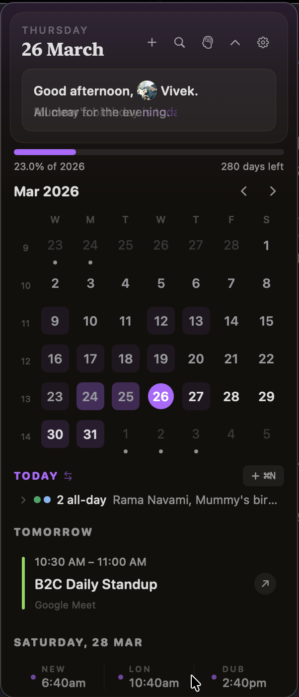
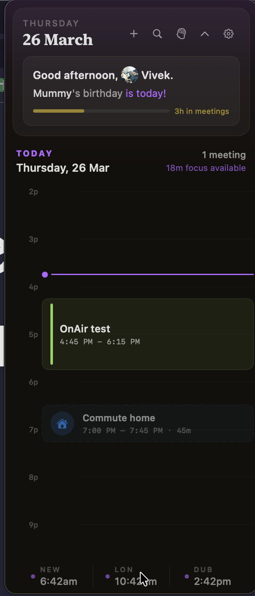
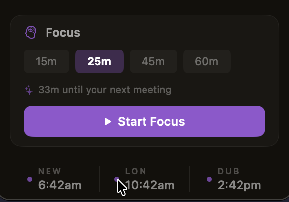
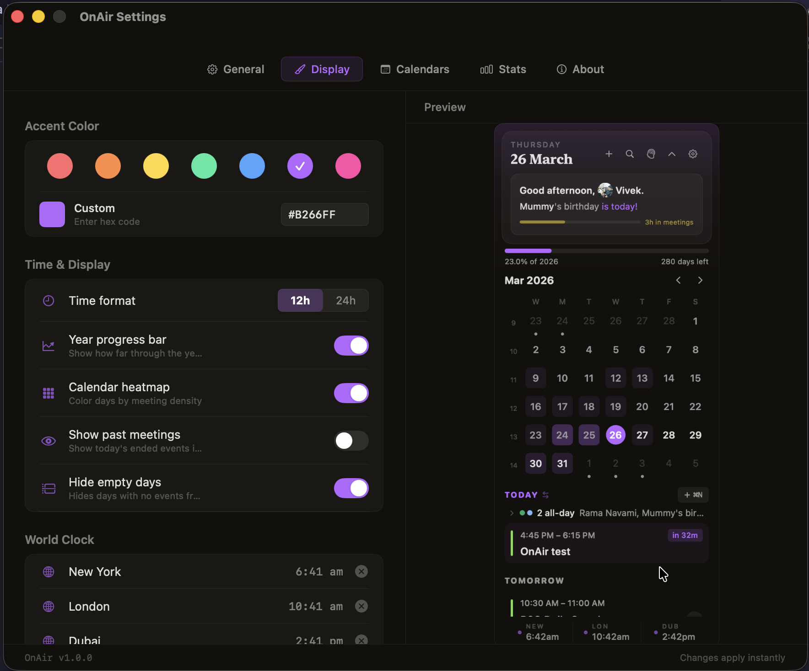

# OnAir

Your next meeting, right there in the menu bar.

Native Swift, about 2MB, reads your Mac calendar. No account, no subscription, no Electron. I built this because I got tired of paying $10/month for a calendar app that is basically a web browser wearing a trench coat.

## Install

```bash
brew tap chaiovercode/tap
brew install --cask on-air
```

Or grab the zip from [Releases](https://github.com/chaiovercode/on-air/releases), unzip, double-click `install.command`.

## Screenshots

<p>
  
  
  
</p>

<p>
  
</p>

## What it does

The menu bar shows your next meeting and a countdown. Click it and you get your whole day.

- Timeline view of your day. Drag meetings around if plans change.
- Focus blocks that know about your calendar. Start a 30-minute block and it will not let you run into your 2pm.
- Natural language events. Type "lunch with Raj tomorrow at 1pm for 1h" and it figures it out.
- Conflict tags on overlapping meetings.
- One-click join for Zoom, Meet, Teams links.
- Wrap-up alerts before your current meeting ends, so you stop talking before people start leaving.
- Stats with a year-long contribution graph, who you meet most, peak hours. Filter by week, month, or year.
- World clocks (up to 4) at the bottom of the panel.
- Keyboard shortcuts: `J` to join, `T` for timeline, `Cmd+N` for new event.

## Requirements

macOS 13 or later. It will ask for calendar access on first launch.

## Build from source

```bash
git clone https://github.com/chaiovercode/on-air.git
cd on-air
make build
```

App ends up in `build/Build/Products/Debug/OnAir.app`.

## License

MIT
